# PrivacyLens AI — Offline Shield

> **PrivacyLens AI** is an offline-first cybersecurity platform that leverages browser-based On-Device AI to detect phishing emails, malicious websites, fraudulent QR codes, scam SMS messages, and suspicious screenshots. By performing intelligent threat analysis locally using **Transformers.js** and **DistilBERT**, the application protects user privacy, reduces latency, and continues to function even without an active internet connection.

---

## 🎯 Problem Statement

Cybersecurity attacks such as phishing emails, malicious websites, QR code scams (quishing), and SMS-based phishing (smishing) are becoming increasingly sophisticated and difficult to identify. Many AI-powered security solutions depend on cloud-based inference, requiring users to upload sensitive information for analysis. This raises privacy concerns, introduces additional latency, and limits usability in low-connectivity or offline environments.

PrivacyLens AI addresses these challenges by bringing AI inference directly to the user's device. Using browser-based machine learning, it analyzes potential threats locally, ensuring that sensitive data remains on the device while providing fast, privacy-preserving, and offline-capable cybersecurity assistance.
---
# 🌐 Live Demo

**Try PrivacyLens AI here:**

🔗 (https://privacylens-ai.ai.studio/)

> Experience browser-based, privacy-preserving cybersecurity powered by On-Device AI.
---
## Solution Overview
PrivacyLens AI is an offline-first browser application that performs AI-powered cybersecurity analysis completely on-device. It detects phishing emails, scam SMS messages, malicious QR codes, suspicious URLs, and spoofed website screenshots using locally executed AI models, browser storage, and offline caching.
The platform combines modern web technologies with browser-based machine learning to provide secure, low-latency, privacy-preserving threat detection without relying on cloud AI inference.
---
## 🧠 How PrivacyLens AI Uses On-Device AI
Unlike traditional AI-powered security platforms, PrivacyLens AI performs all inference directly inside the user's browser.
- All AI models execute locally using browser-based inference.
- Sensitive emails, SMS messages, URLs, QR codes, and screenshots never leave the user's device.
- Browser technologies such as WebAssembly, IndexedDB, and Service Workers enable fast, secure, and offline-capable AI processing.
- After the initial model download, the application can continue analyzing content even without an active internet connection.
- This architecture provides lower latency, improved privacy, and complete user control over sensitive information.
---
## Key Features & Capabilities
*   **⚡ Progressive Web App (PWA) Support**: 100% installable with responsive standalone launch capability, automatic service worker updates, and customizable branding assets.
*   **📡 Offline Cache Integrity**: Cache-First strategy for neural weights combined with Network-First fallback models for application files. The application runs and functions flawlessly without active internet connections.
*   **🧠 Local Model Pre-Caching**: Allows users to download and store the complete BERT transformer model weights (`Xenova/distilbert-base-uncased-finetuned-sst-2-english`) directly into their local browser cache.
*   **📊 Threat Intelligence Analytics Dashboard**: Robust visual graphics built with React & Recharts monitoring threat ratios, chronological scan counts, anomaly alerts, model inference confidence buckets, and engine F1 scores.
*   **📬 Multi-Vector Shield Engines**: Dedicated client scanners for Emails, SMS messages, Website domains, visual screens (OCR/Vision), and raw QR payloads.
*   **🔄 Background Synchronized Ledger**: Safe, delayed integration leveraging W3C Background Sync to push offline threat logs to a decentralized intelligence ledger when connectivity returns.
---
---

# 🏗️ System Architecture

```text
                    User

                      │

                      ▼

     Email / SMS / QR / Screenshot

                      │

                      ▼

     Browser-Based AI Engine
      (Transformers.js)

                      │

                      ▼

      Threat Classification Engine

                      │

                      ▼

Risk Score + Explainable AI Output

                      │

                      ▼

 IndexedDB (Local Scan History)

                      │

                      ▼

 Analytics Dashboard

---
# 🛠️ Tech Stack

| Category | Technologies |
|-----------|--------------|
| **Frontend** | React, TypeScript, Vite |
| **UI & Styling** | Tailwind CSS, Glassmorphism Design |
| **On-Device AI** | Transformers.js, DistilBERT, WebAssembly |
| **Browser APIs** | IndexedDB, Service Workers, Background Sync, Cache API |
| **Security Modules** | Email Scanner, SMS Scanner, Website Scanner, QR Scanner, Screenshot Analyzer |
| **Data Visualization** | Recharts |
| **Offline Support** | Progressive Web App (PWA), Offline Caching |
| **Development Tools** | Node.js, npm |
| **Deployment** | Docker, Vercel, Netlify, GitHub Pages |
| **Version Control** | Git, GitHub |
---

# 📂 Project Structure

The project follows a modular and scalable architecture designed for maintainability and future expansion.

```text
PrivacyLens-AI
│
├── .github/
│   └── workflows/
│       └── deploy.yml               # CI/CD workflow
│
├── docs/
│   └── screenshots/                 # README screenshots
│
├── public/
│   ├── icon.svg                     # Application icon
│   ├── manifest.json                # PWA Manifest
│   └── sw.js                        # Service Worker
│
├── src/
│   │
│   ├── components/
│   │   ├── AnimatedBackground.tsx
│   │   ├── Header.tsx
│   │   ├── RiskMeter.tsx
│   │   └── Sidebar.tsx
│   │
│   ├── views/
│   │   ├── Dashboard.tsx
│   │   ├── EmailScanner.tsx
│   │   ├── SmsScanner.tsx
│   │   ├── WebsiteScanner.tsx
│   │   ├── QrScanner.tsx
│   │   ├── ScreenshotAnalyzer.tsx
│   │   ├── LocalAiClassifier.tsx
│   │   ├── Analytics.tsx
│   │   ├── ScanHistory.tsx
│   │   ├── AiResults.tsx
│   │   └── Settings.tsx
│   │
│   ├── App.tsx
│   ├── main.tsx
│   ├── index.css
│   └── types.ts
│
├── .dockerignore
├── Dockerfile
├── LICENSE
├── README.md
├── package.json
└── vite.config.ts
```

---

## Installation Guide

Follow these simple commands to setup the development environment on your local machine:

### Prerequisites

*   **Node.js**: `v18.0.0` or higher
*   **npm**: `v9.0.0` or higher

### Local Setup

1. **Clone the repository**:
   ```bash
   git clone https://github.com/your-username/privacylens-ai.git
   cd privacylens-ai
   ```

2. **Install node dependencies**:
   ```bash
   npm install
   ```

3. **Launch the development server**:
   ```bash
   npm run dev
   ```
   *The server will boot up and bind to `http://localhost:3000`.*

---

## Usage Guide

1. **First-Time Visit**: Launch the app. The core service worker will intercept resources and pre-cache all static HTML, CSS, and JS components to prepare for offline capability.
2. **Install to Device**: Look for the glowing **"INSTALL APP"** pill in the top header (or click "Install Native Client" in Settings) to install PrivacyLens directly onto your mobile home-screen or desktop application dock.
3. **Download Model Layers**: Navigate to **Settings** and trigger **"Pre-cache Offline AI Model"**. This will download the ONNX weights of the DistilBERT transformer layer directly into your browser's persistent cache.
4. **Inspect Heuristics & Scans**: Input text, upload screens, paste emails, or analyze urls. Toggle internet connection off. All scanners continue to output results, score threat likelihood, and classify payloads instantaneously with Zero-latency.
5. **Analyze Incidents**: Head to the **Threat Intelligence Command** tab (Analytics) to monitor detailed, beautiful, interactive diagrams indicating threat sources, risk distributions, and WASM runtime latency metrics.

---

# 🧪 Sample Inputs and Expected Outputs

## 📧 Email Phishing Analyzer

### Sample Input

**Subject:**
Urgent! Verify Your Bank Account

**Body:**
Your account has been suspended due to suspicious activity. Click the link below immediately to verify your credentials.

### Expected Output

- Threat Level: **High**
- Risk Score: **100%**
- Indicators:
  - Suspicious urgency
  - Credential harvesting language
  - Suspicious domain
- Recommendation:
  Do not click the provided link. Verify directly through the official website.

---

## 🌐 Website Typosquat Scanner

### Sample Input

http://paypaI-login-security.com

### Expected Output

- Classification: **Malicious**
- Threat Indicators:
  - Typosquatting detected
  - HTTP (Unsecured)
  - Suspicious domain structure
- Recommendation:
  Avoid visiting the website.

---

## 💬 SMS Smishing Shield

### Sample Input

Your bank account has been locked. Verify immediately:
http://secure-bank-login.xyz

### Expected Output

- Threat Level: **High**
- Classification: **Smishing Attempt**
- Recommendation:
  Ignore the message and verify through your bank's official application.

---

## 📱 QR Quishing Guard

### Sample Input

QR Code containing:
https://secure-login-update.xyz

### Expected Output

- Classification: **Suspicious**
- Threat Indicators:
  - Unknown domain
  - Potential phishing URL
- Recommendation:
  Verify the destination before opening.

---

## Deployment Instructions

### Standard Production Build

Compile static, minified files directly with Vite:
```bash
npm run build
```
This produces optimized production assets inside the `/dist` directory, fully prepared for server hosting on Cloud Run, Vercel, Netlify, or Github Pages.

### Dockerized Deployment (Production Containers)

Run PrivacyLens inside a lightweight, highly secure, custom Alpine-based Nginx container:

1. **Build the container image**:
   ```bash
   docker build -t privacylens-ai:latest .
   ```

2. **Run the container**:
   ```bash
   docker run -d -p 8080:80 --name privacylens-app privacylens-ai:latest
   ```
   *Access the running web portal by navigating to `http://localhost:8080`.*

---
---

# 🎥 Demo Video

A complete walkthrough of PrivacyLens AI demonstrating browser-based on-device AI inference, offline functionality, and cybersecurity threat detection.

**Demo Link:**

> https://drive.google.com/file/d/1bEiBuzgpsfsm8XSKpKpe1l0EChqey4FK/view?usp=sharing
---

## Demo Section

Below is a brief functional sequence highlighting on-device offline security processing:

```text
[ USER INPUT (OFFLINE MODE) ]
      │
      ▼
[ LOCAL MODEL COMPILER ] ───► Local Vocab Index matches "paypal-login-secure.com" (PHISHING)
      │
      ▼
[ TRANSFOMERS.JS BERT INFERENCE ] ───► Classifies: "Urgent response required..." (94% threat score)
      │
      ▼
[ INSTANT RISK RATING METER ] ───► Displays alert: "CRITICAL INCIDENT DEFLECTED"
      │
      ▼
[ OFFLINE LEDGER QUEUE ] ───► Stores telemetry in cache, triggers Background Sync
```

---

# 📸 Screenshots

The following screenshots showcase the key features and workflow of PrivacyLens AI.

---

## 1. Welcome Portal

The landing page introduces PrivacyLens AI, highlighting its offline-first architecture and browser-based cybersecurity capabilities.

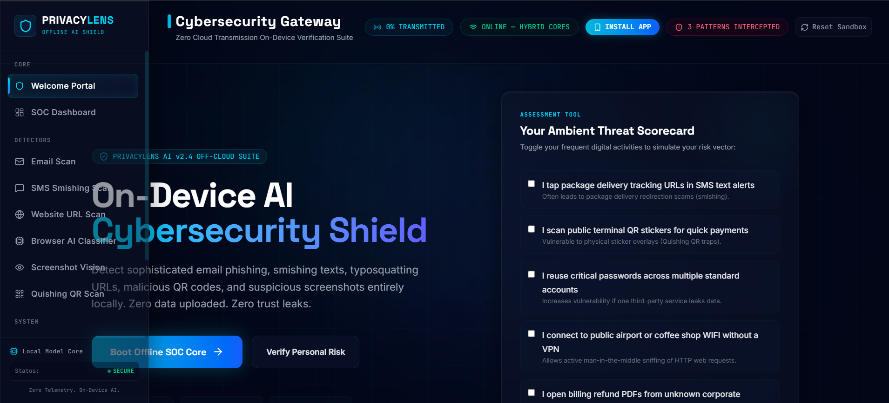

---

## 2. SOC Dashboard

The Security Operations Center (SOC) dashboard provides an overview of system status, threat summaries, recent activity, and quick access to all security modules.

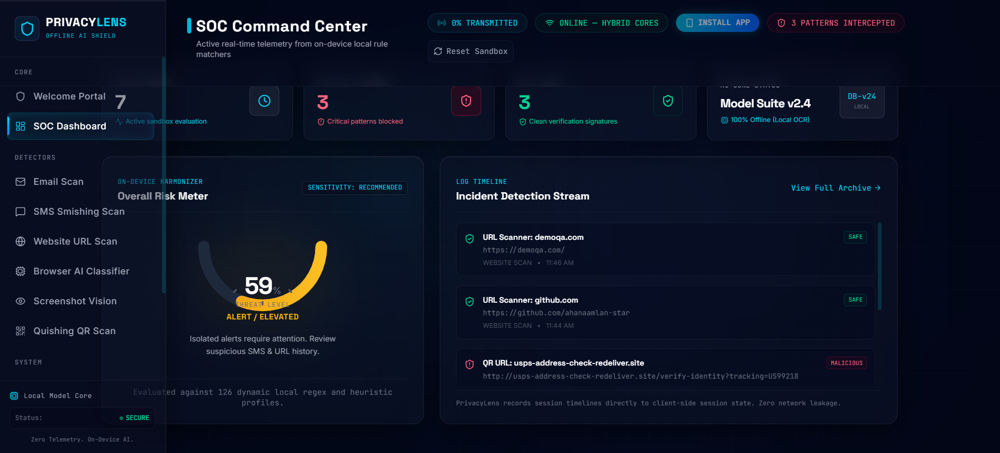

---

## 3. Email Phishing Analyzer

Analyze suspicious emails locally using on-device AI to identify phishing attempts, suspicious language, and malicious intent.

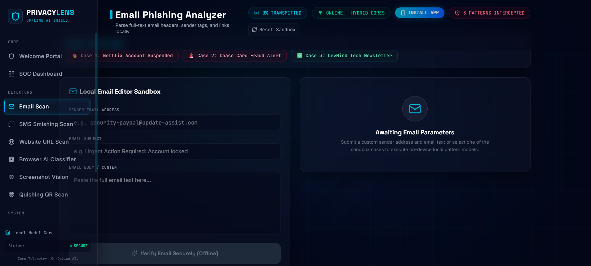

---

## 4. Email Detection Result

Displays the AI-generated threat assessment, confidence score, detected phishing indicators, and recommended mitigation steps.

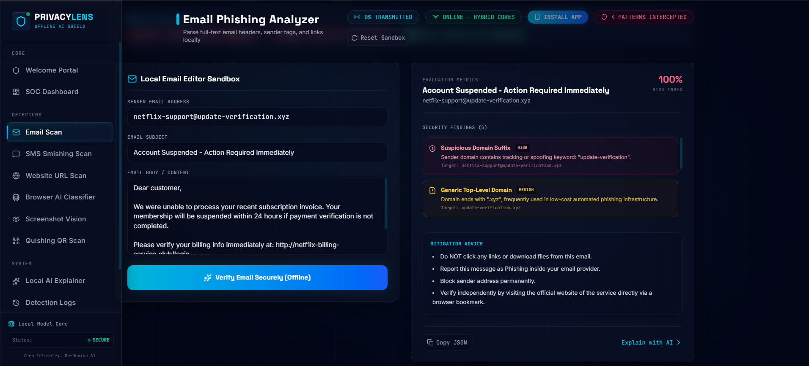

---

## 5. SMS Smishing Shield

Detect fraudulent SMS messages and identify common smishing patterns without sending message content to external servers.

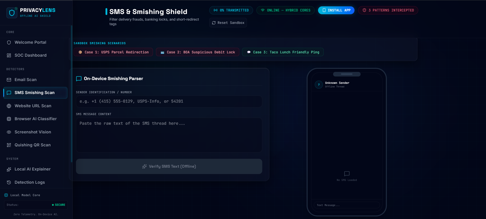

---

## 6. Website URL Scanner

Analyze suspicious URLs and identify typosquatting, malicious domains, and insecure website characteristics.

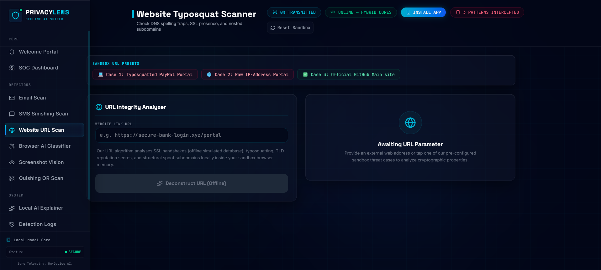

---

## 7. Website Detection Result

The AI explains why a website is classified as suspicious by highlighting detected indicators and providing security recommendations.

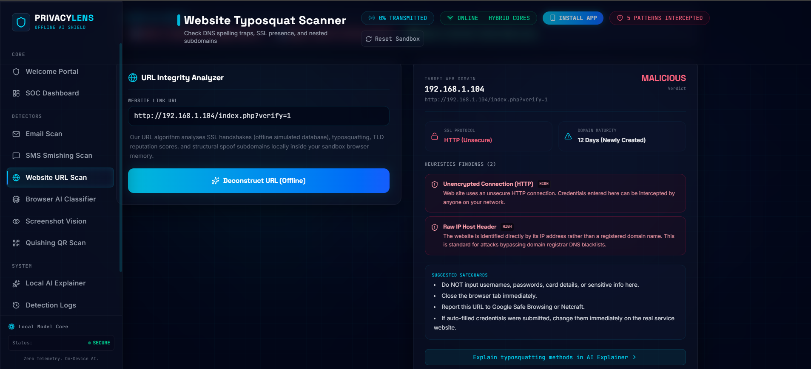

---

## 8. Screenshot Vision OCR

Upload screenshots of suspicious webpages for local OCR extraction and phishing analysis.

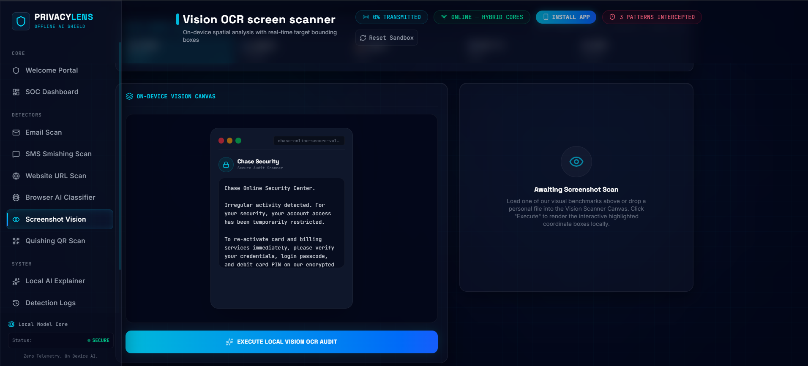

---

## 9. QR Quishing Guard

Inspect QR codes locally to identify potentially malicious destinations before opening them.

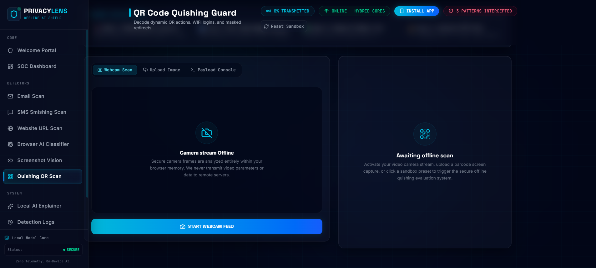

---

## 10. Threat Intelligence Dashboard

Interactive visualizations summarize detected threats, incident trends, and overall security posture.

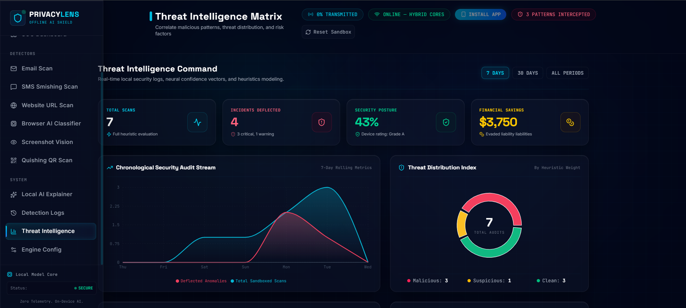

---

## 11. AI Model Metrics & Telemetry

Displays AI confidence metrics, model performance indicators, and overall inference statistics for greater transparency.

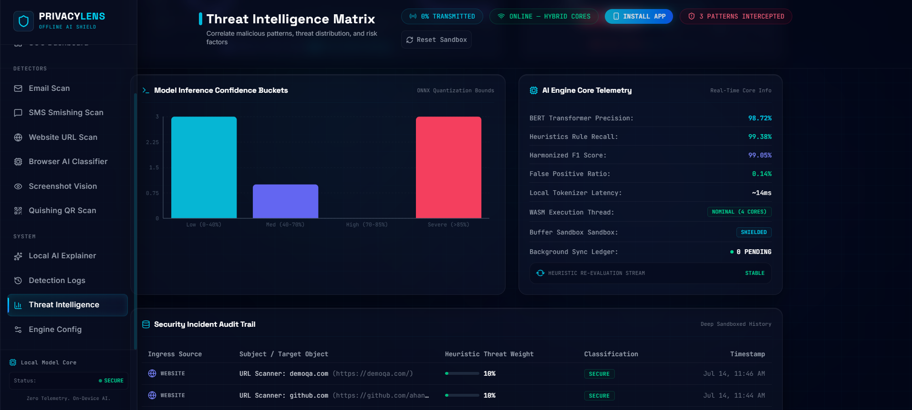

---

# 🌟 Why PrivacyLens AI?

✔ 100% Browser-Based On-Device AI

✔ Privacy-First Architecture

✔ Zero Cloud AI Processing

✔ Offline-First Design

✔ Real-Time Threat Detection

✔ Explainable AI Results

✔ Progressive Web App Support

✔ Local Data Storage

✔ Lightweight and Fast
---

## Future Scope

1.  **🔍 WebAssembly-Powered YARA Rules**: Run advanced, standard security signature scans against files and packages in complete sandboxed client storage.
2.  **🛰️ Distributed P2P Threat Ledger**: Decentralized offline peer networks syncing threat alerts without central web-servers.
3.  **🎤 Local Vocal Spoof Detection**: Transcribe and analyze incoming spam voice files or phone audio tracks locally to flag audio cloning/phishing.

---
---

# 👩‍💻 Developed By

**Ahana Amlan Sahoo**

B.Tech Information Technology

Manipal Institute of Technology, Bengaluru
---

## License

This project is open-source and released under the terms of the [MIT License](/LICENSE).
